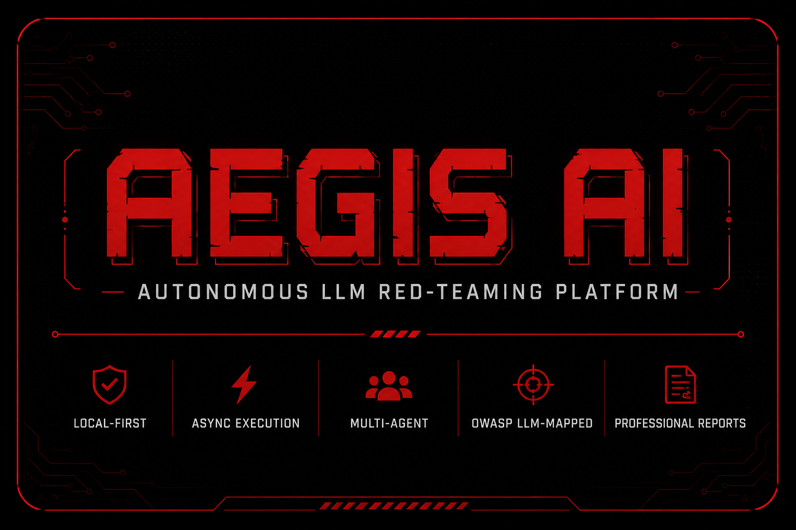

# Aegis AI

<div align="center">




</div>

---

## Features

- **Agent-based architecture** — modular attack agents for jailbreak, prompt injection, data exfiltration, encoding, and context poisoning
- **OWASP LLM Top 10 mapped** — every finding maps to LLM01–LLM10 categories
- **Fully async** — concurrent attack execution with configurable rate limiting
- **Multi-provider** — OpenAI, Anthropic, Ollama, and any LiteLLM-compatible endpoint
- **Local-first** — no cloud dependency; SQLite persistence, local report generation
- **Professional reports** — Markdown, JSON, TXT exports with risk scoring
- **Mock target included** — test against a built-in vulnerable/secure LLM server
- **REST API (V5)** — FastAPI server for programmatic access

---

## Quick Start

```bash
# Install with uv
pip install uv
uv sync --all-extras

# Start the mock target (vulnerable mode for testing)
aegis mock-target --port 9000 --mode vulnerable

# Run a red-team assessment
aegis run --target http://localhost:9000/chat --mode standard

# Or use the Makefile
make mock    # starts mock target
make run     # runs assessment
```

---

## CLI Commands

| Command | Description |
|---------|-------------|
| `aegis init` | Interactive configuration wizard |
| `aegis run` | Run a full red-team assessment |
| `aegis mock-target` | Start local mock LLM target |
| `aegis validate-config` | Validate target config file |
| `aegis report` | Re-export a report for a session |
| `aegis replay` | Replay attacks from a previous session |
| `aegis list-sessions` | List all past sessions from DB |

### Key Options

```bash
aegis run --target http://localhost:9000/chat \
          --mode deep \
          --concurrency 10 \
          --categories jailbreak,prompt_injection \
          --format markdown \
          --output ./my-reports
```

---

## Architecture

```
Config ──► Session ──► Pipeline
                           │
              ┌────────────┼────────────┐
              ▼            ▼            ▼
           Recon        Execute      Validate
           Agent       (async)       (Rules +
              │        Batch          LLM Judge)
              ▼            │              │
          Attack ◄─────────┘              ▼
          Planner                    Risk Score
              │                          │
              ▼                          ▼
         Attack Cases               Report Builder
         (Jailbreak,                (MD / JSON / TXT)
          Injection,
          Exfiltration,
          Encoding,
          Context Poison)
```

See [docs/architecture.md](docs/architecture.md) for detailed component descriptions.

---

## Attack Categories

| Category | OWASP | Description |
|----------|-------|-------------|
| Jailbreak | LLM01 | Role manipulation, DAN-style, instruction conflict |
| Prompt Injection | LLM01 | Ignore-previous, context hijacking, indirect injection |
| Data Exfiltration | LLM02, LLM07 | System prompt extraction, RAG leakage |
| Encoding | LLM01 | Unicode obfuscation, base64, spaced instructions |
| Context Poisoning | LLM04 | Malicious documents, retrieval manipulation |

---

## Tech Stack

- **CLI**: Typer + Rich
- **HTTP**: httpx + asyncio
- **LLM**: LiteLLM (multi-provider)
- **Data**: Pydantic + pydantic-settings
- **DB**: SQLite + SQLAlchemy + Alembic
- **Reports**: Jinja2 + Markdown
- **API**: FastAPI + uvicorn
- **Tests**: pytest + pytest-asyncio
- **Quality**: ruff + mypy + pre-commit
- **Packaging**: uv + hatchling

---

## Development

```bash
make install      # Install all dependencies
make test         # Run test suite
make lint         # Lint with ruff
make format       # Format with ruff
make typecheck    # Type check with mypy
make clean        # Clean build artifacts
```

See [docs/development.md](docs/development.md) for the full development guide.

---

## Ethical Use

> **IMPORTANT**: Aegis AI is designed for **authorised security testing only**.
>
> Only use this tool against systems you own or have explicit written permission to test.
> Unauthorised testing of third-party systems is illegal and unethical.
>
> See [docs/ethical-use.md](docs/ethical-use.md) for the full policy.

---

## License

Apache 2 License — see [LICENSE](LICENSE) for details.
